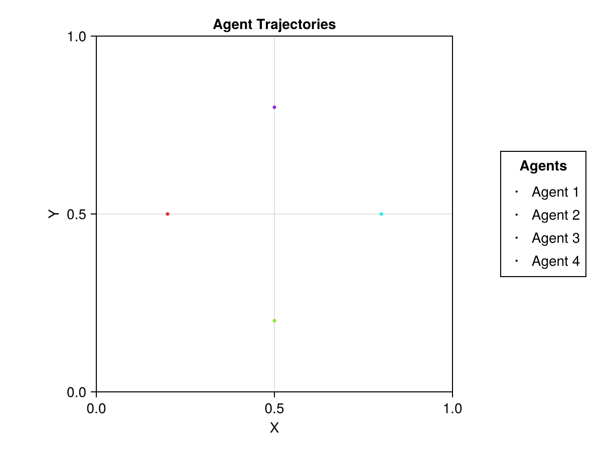

# R3R: A Decentralized Multi-Agent Motion Planning Framework

This project is a simulation framework written in Julia for decentralized, multi-agent motion planning. It implements the "Gatekeeper" algorithm, which allows multiple agents to navigate to their goals in a shared 2D environment while avoiding collisions with one another.

The core of the pathfinding logic leverages a custom Julia implementation of the DynamicRRT* algorithm.

## Example Simulations

| 4 Agents in a Circle | 60 Agents in a Circle |
|-----------------------|-----------------------|
|  |  |
| 48 Agents in an Indoor Map | 5 Agents at Willow Garage |
|  |  |

## Key Features

*   **Decentralized Coordination:** No central controller is required. Agents coordinate with their local neighbors.
*   **Collision-Free Navigation:** Implements a robust strategy based on committed trajectories and backup sets to ensure safety.
*   **High-Performance Path Planning:** Integrates the DynamicRRT* algorithm for efficient, dynamically-aware pathfinding.
*   **Extensible Agent Models:** The framework supports different types of agents with varying dynamics, such as:
    *   `dubins_agent_2d`: An agent with Dubins vehicle dynamics.
    *   `DoubleIntegrator2D`: A more complex agent with velocity and acceleration, controlled by a Model Predictive Controller (MPC).
*   **Simulation & Visualization:** Includes tools to run simulations and generate `.gif` animations of the results.

## Core Concepts

The "Gatekeeper" algorithm is built on a few key ideas:

1.  **Joining the Network:** An agent can only begin moving if it can find a safe initial trajectory that doesn't conflict with agents already in the "network".
2.  **Committed Trajectories:** Each agent has a `committed_trajectory` that it broadcasts to its neighbors. This is the path it guarantees it will follow for a certain time horizon.
3.  **Replanning:** Agents must replan a new `candidate_trajectory` before their current one expires. An agent can only commit to a new trajectory if it is validated to be collision-free with respect to its neighbors' committed trajectories.
4.  **Backup Sets:** Each trajectory includes a `backup_set`, which is a safe, pre-planned stopping point. If an agent fails to find a new valid trajectory, it can execute its backup plan to come to a safe stop, preventing collisions.

## Custom Julia Packages
Dubins.jl: https://github.com/dev10110/Dubins.jl.git

DynamicRRT.jl: https://github.com/MarshallVielmetti/DynamicRRT.jl.git

OccupancyGrids.jl: https://github.com/MarshallVielmetti/OccupancyGrids.jl.git

## Project Structure

```
/
├── Project.toml        # Julia project dependencies
├── src/
│   ├── r3r.jl          # Main project module
│   ├── gatekeeper.jl   # Core logic for the decentralized Gatekeeper algorithm
│   ├── 2d_double_integrators.jl # Logic for double-integrator agents
│   ├── double_integrators_gatekeeper.jl # Gatekeeper logic for double-integrator agents
│   ├── plot_utils.jl   # Utilities for animating simulations
│   ├── agents/
│   │   └── dubins_agent_2d_model.jl # Agent logic for Dubins agents
│   └── common/
│       ├── R3RCommon.jl # Common types and utilities
│       ├── types.jl
│       └── utils.jl
├── test/               # Unit and integration tests
└── outputs/            # Default directory for saved animations
```

## Getting Started

### Prerequisites

*   Julia (v1.6 or later recommended)

### 1. Install Julia Dependencies

Navigate to the project root directory and start the Julia REPL.

```bash
julia
```

Enter the package manager by pressing `]` and activate the project environment.

```julia
pkg> activate .
pkg> instantiate
```

### 2. Run a Simulation

Simulations can be run from within the Julia REPL after activating the project environment. The results, typically `.gif` animations, are saved in the `outputs/` directory.